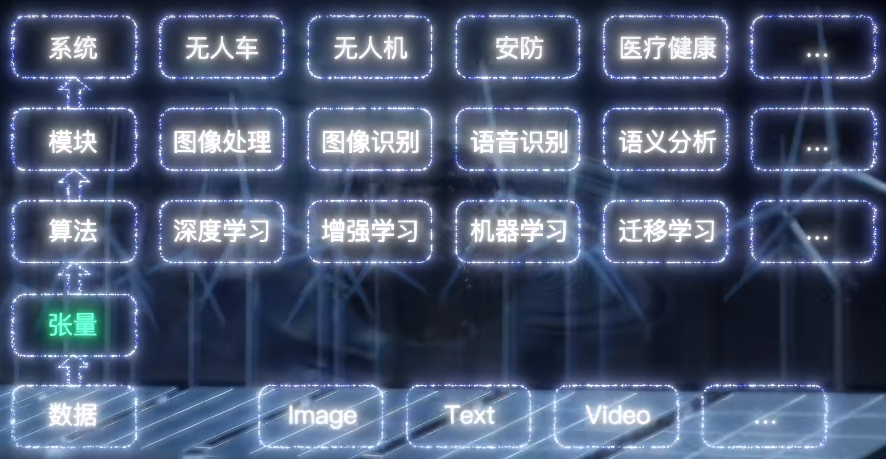
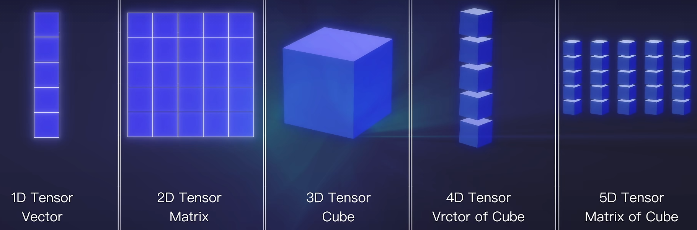
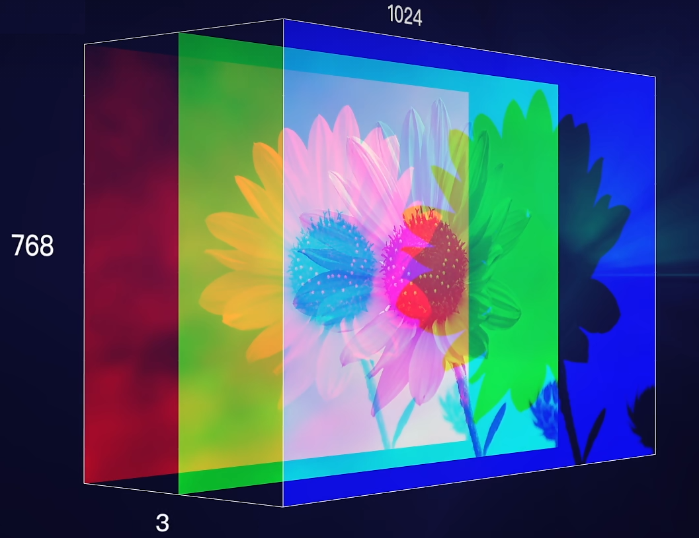

# 什么是AI

人工智能AI (Artificial intelligence)。

是一种利用机器学习、自然语言处理、计算机视觉和深度学习等技术实现的仿人智能。

使计算机能够学习、自主决策和执行任务，以便实现类型人类行为的智能体。

# AI在生活中的应用场景

- 自然语言处理
  - ChatGPT
  - 智能客服
- 计算机视觉
  - 车牌识别
  - 车道检测
  - 身份证、银行卡识别
  - 人脸识别
- 模式识别
  - 图像分类
  - 自动分拣
- 推荐系统
  - 淘宝、抖音内容推送
- 综合
  - 辅助驾驶
  - 智能家居
  - 医疗
  - 娱乐创意


# 如何拥有一个自己的AI

- 确定应用场景，明确AI要做的事情
- 选择深度学习框架(AI引擎)，搭建一个AI的学习平台
- 采集相关训练数据，教会AI做事
- 选择算法，训练AI
- 从学习数据中取部分数据验证训练结果
- 进行真实场景的使用
- 部署到设备或服务器上


# 主流AI学习框架

- TensorFlow：Google开发

- PyTorch：Facebook开发

他们都是主流的人工智能学习框架，生态系统已经非常丰富，拥有大量的工具和库。可以方便地构建、训练和部署深度学习模型。

## PyTorch安装

```bash
pip install torch torchvision torchaudio
```


# 张量的概念

张量Tensor

人类学习是通过自己的所见所闻或汲取他人经验。

AI也需要学习、训练变得更只能。

无论是人还是机器，都会通过文本、图片、音频、视频等来进行学习。这些统称为数据。

机器要利用数据学习，就要用一个统一的容器来保存这些数据。张量就是这样的一个容器。

所以说，**张量是一种数据结构，可以保存任意类型的数据，也是机器学习中的基本运算单位。本质是一个多维数组。**



## 张量的维度

不同维度的张量，可以表示不同类型的数据



- 0维张量
  - 就是一个标量，包含一个单一的数值
  - 如一个数字225
- 1维张量
  - 就是一个数组
  - 如[11,2,3,44,5]
- 2维张量
  - 就是一个二维数组，矩阵
  - 如[[1,2,3],[4,5,6]]
- 3维张量
  - 就是一个三维数组
  - 可以表示一张彩色图片
  - 
- 4维张量
  - 4维张量可以表示一批图像数据，其中四个维度分别代表：样本数量、图像高度、图像宽度和颜色通道数