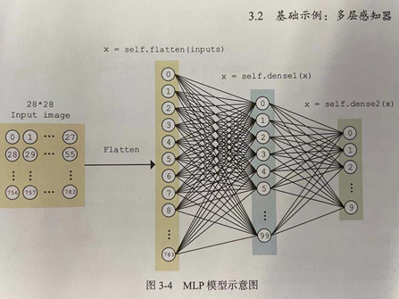
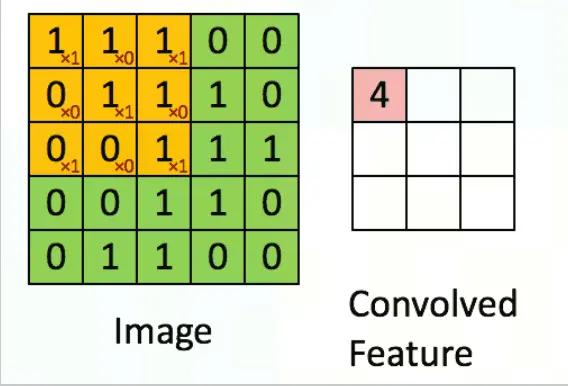
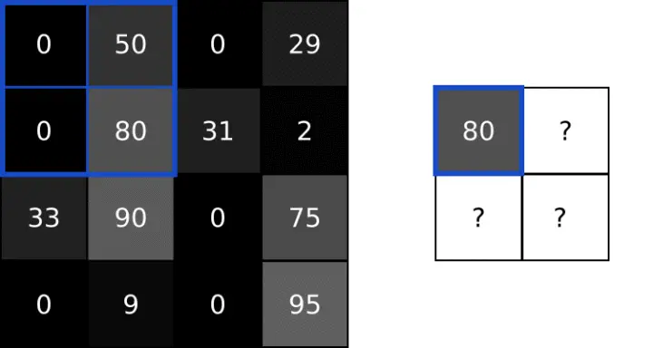
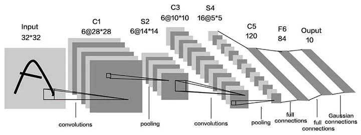

# 创建神经网络模型

在PyTorch框架中，创建一个神经网络模型，可以通过创建`torch.nn.Module`模块的实例来实现。

通过定义一个类继承`torch.nn.Module`

```python
import torch.nn

# 创建一个类，继承torch.nn.Module，即可称为一个模型类的子类
class MyNet(torch.nn.Module):
    # 需要写出构造方法，在构造方法中调用父类的构造方法
    def __init__(self):
        super(MyNet, self).__init__()
        print("执行自定义的神经网络模型的构造方法，通常在这里定义神经网络中的隐藏层")

    # 前向传播，用于接收参数，得到输出。这里的x就是输入
    def forward(self, x):
        print("执行自定义神经网络模型的前向传播方法，用于操作输入的参数")
        return x ** 2

model = MyNet()
output = model.forward(5)
print(output)
```

# 全连接神经网络



```python
# 创建神经网络
# 创建一个类，继承torch.nn.Module
# 实现其中具体的隐藏层的内容 Nerual Net
import torch.nn as nn

class MyNet(nn.Module):
    def __init__(self):
        super(MyNet, self).__init__()
        # 创建神经网络序列来定义隐藏层中的每一层
        self.sequential = nn.Sequential(
            # 1.张量展平
            # 将784个像素值保存到一个一位张量中
            # 原图张量形状为(1,28,28),经过展平后形状为(1,784)
            nn.Flatten(),
            # 2.经过全连接层，将784个输入转换为100个输出(总结为100个新特征)
            nn.Linear(784, 100),
            # 3.激活函数
            nn.ReLU(),
            # 4.经过全连接层，将100个输入转换为10个输出
            nn.Linear(100, 10),
            # 5.LogSoftmax函数，可以将10个输出映射到(0,1)的范围内，保证10个输出的结果之和为1
            nn.LogSoftmax(dim=1)
        )

    def forward(self, x):
        return self.sequential(x)

```

如果使用全连接神经网络，会有以下几个问题

1.参数数量过多

2.计算量大

3.无法充分利用图像的空间结构信息

4.缺乏平移、旋转等不确定性

# 卷积神经网络

## 卷积Convolving

卷积操作通常是通过一个称为"卷积核"或"滤波器"的小矩阵来实现的。

卷积核在原图的输入矩阵上滑动，与重叠区域进行矩阵乘法，将结果相加得到一个新的值。

这个过程会遍历输入矩阵，最终生成一个新的特征图。

卷积可以在提取原图的数据特征的基础上，缩小尺寸。

在下图中，黄色部分就是一个卷积核，绿色部分是原图输入矩阵，右侧的图是卷积后的新特征图。

原图的尺寸会变为(原图大小-卷积核大小+1)



## 池化Pooling

池化通过对输入数据的局部区域进行某种统计运算来生成一个新的特征图。

常用的池化操作有最大值池化和平均值池化等。

下图中就是最大值池化。将原图的宽高减少一半。

通常在卷积后进行池化的操作，在保留原始特征的同时进一步压缩原图大小。



通过卷积、池化进行优化神经网络



```python
# 创建卷积神经网络
import torch.nn as nn

class MyNet(nn.Module):
    def __init__(self):
        super(MyNet, self).__init__()
        self.seq = nn.Sequential(
            # 设计卷积神经网络中的每一层
            # 第一次卷积，使用10个3*3卷积核，得到10个新特征
            # 28*28 -->  28-3+1  --> 26*26
            nn.Conv2d(1, 10, 3),
            # 激活函数
            nn.ReLU(),
            # 第一次池化，使用2*2窗口，每次移动2个步长
            nn.MaxPool2d(2, 2),
            # 26*26 --> 13*13
            # 第二次卷积，使用20个5*5卷积核，得到20个新特征
            nn.Conv2d(10, 20, 5),
            # 13*13 --> 13-5+1 -->9*9
            # 展平
            nn.Flatten(),
            # 第一个全连接20*9*9 --> 100
            nn.Linear(20 * 9 * 9, 100),
            # 激活函数
            nn.ReLU(),
            # 第二个全连接100 --> 10
            nn.Linear(100, 10),
            nn.LogSoftmax(dim=1)
        )

    def forward(self, x):
        return self.seq(x)

```

