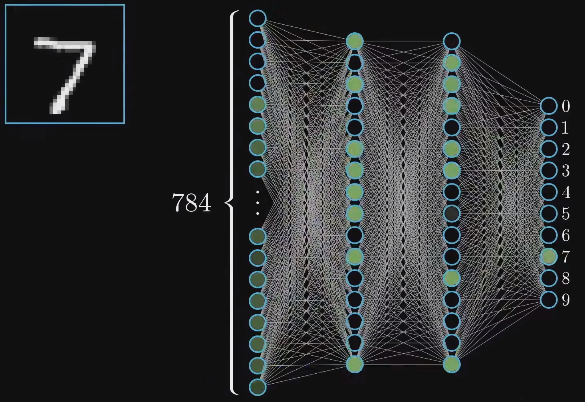
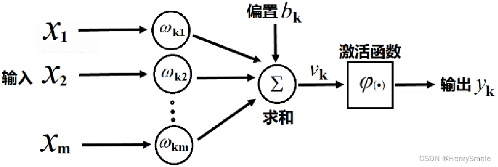
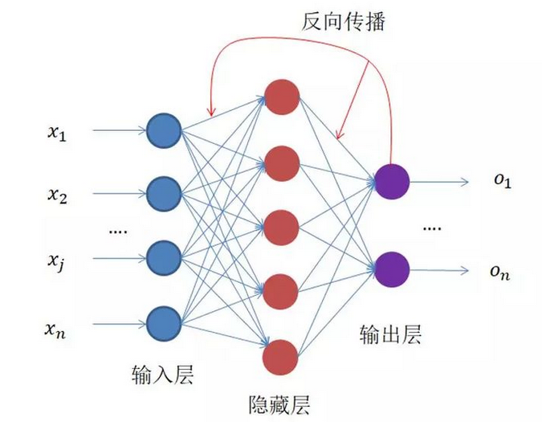

# AI如何识别图片中的数字

MNIST数据集中的某一张图片被识别，最终结果是0-9之间的一个数。

机器并不能明确这张图片是数字几，只能得到"是数字几的概率"，概率值最大的，就是AI认为的结果。

就像人认字，通过反复认识某个字，总结字的规律特征，最终认为是什么字。

机器会将28*28的图片的所有像素点，一共784个像素对应的数字保存到一个集合中作为输入，最终得到10个输出，表示0-9的概率

在上图中，这784个像素会经过一个叫"全连接层"的东西，会把图片的每一个像素与一个权重关联起来，这个权重就是对于这个数字图片来说，这个像素点的重要程度。

机器会不断接受某个数字不同形状的图片来学习，总结这个数字中，每个像素点的重要程度，根据图片对应的数字调整这个权重。

当学习到一定程度时，使用一张新的图片测试，就会利用之前学习到的权重去计算这个图片可能是哪个数字，得到10个概率值，概率值最大的就是AI认为的数字。

以上是一种识别数字的方式，这种方式是将所有像素展开，计算每个像素权重，得到结果的过程。

整个过程就是一个神经网络。

# 神经网络

Neural network 简称NN

人类通过接收外部数据，不同的数据会触发、激活大脑中不同的神经元组合，进行数据处理和计算，生成相应的指令。

为了实现相似的运作机理，设计了人工神经元，多个神经元组成一个神经网络模型。

## 结构

- 输入层
  - 接收数据
- 隐藏层
  - 该层由多个神经元组成，每个神经元为每个输入配置权重，这些权重随着神经网络训练进行调整
- 输出层
  - 经过神经网络计算后得到结果

## 前向传播

当一个输入经过神经元计算权重得到结果的过程，称为前向传播。

下图中，`x1~xm`都是输入，`wk1~wkm`是`x1~xm`这些参数的权重值，有可能输入没有数据，为了让每个输入都有值，给每个输入添加一个偏置项。

此时每个输入的的表达式为`y=x1*wk1+bk`，是一个线性函数。

## 激活函数

从前向传播的图中可以看出，每个输入的表达式都是一个线性函数。线性函数无论如何延伸，它只能是线性的，只能解决一些简单的线性问题。

显示中往往很多情况都是非线性的，所以需要一个非线性函数来调整模型。这样神经网络就能拟合更复杂的函数。

这个调整线性模型的函数，称为激活函数。像一个开关，决定了神经元的信息能否继续传递到后续的神经元。

也像电路中的开关，使得电流安不同的路径流动，形成复杂电路。

## 反向传播

根据训练的结果和实际值进行比较，反向调整权重的过程，称为反向传播

通过反向传播可以调整输入的权重，从而让神经网络的总误差更小。

